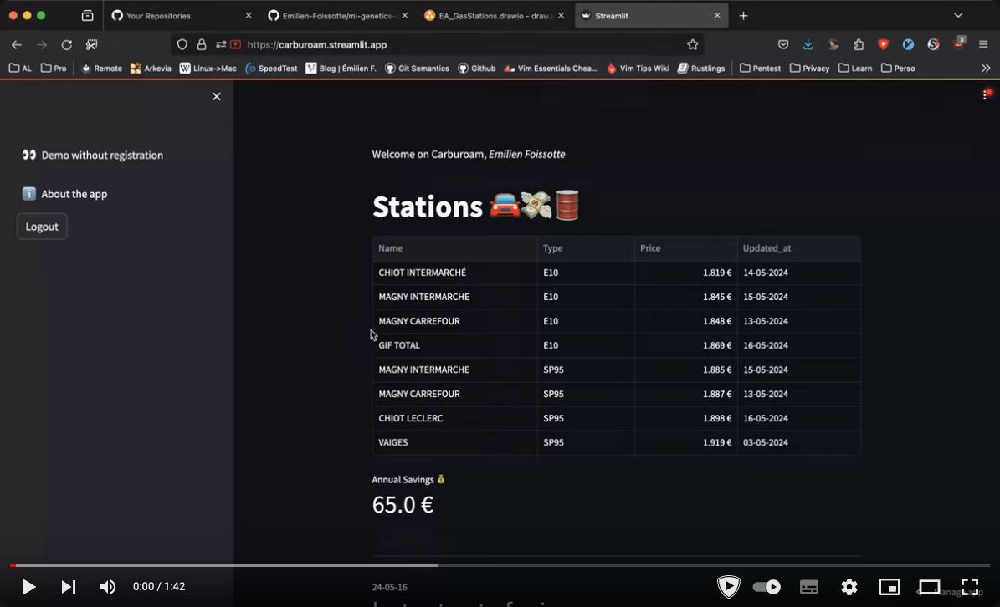

   
  <h1>Carburoam ⛽💸</h1>
  <strong>The first open-source live Gas Station price dashboard.</strong>

 

 <!-- add python version badge -->
  
  
  
  
  

Welcome to the [Carburoam](https://carburoam.streamlit.app/about) repository, it fuels
an Open Source dashboard to help users get cheapest prices at gas stations in 🇫🇷

## Table of Contents

[__TOC__]

## What is Carburoam?

Carburoam is an open-source built dashboard on top of Python, Streamlit and ❤️

It showcase a Data engineering project which :

- retrieve data daily from [data.gouv.fr](https://www.data.gouv.fr/fr/datasets/prix-des-carburants-en-france-flux-instantane-v2-amelioree/)
- load it into a SQLite database
- Expose results to unlogged and logged users in live dashboard 👉 [carburoam.streamlit.app](https://carburoam.streamlit.app/)

## Developer notes

We run on a [Streamlit](https://streamlit.io/) backend, with an AWS S3 distant storage to persist
data accross reboot of the Streamlit server.

A more complete overview of the stack is available in my blog post
⚙️ [here](https://emilien-foissotte.github.io/posts/posts/2024/05/streamlit-gas-stations/?utm_campaign=GasWebApp)

To manage local and distant environments, it uses an `.ENV` file, which shall contain theses keys :

- GMAIL_APP_PASSWORD : app password for streamlit gmail account
- LOAD_MODE="remote|local" : If remote, need AWS_ACCESS_KEY_ID and AWS_SECRET_ACCESS_KEY
- BUCKET_NAME_STORE: Uri of the bucket where config file is stored, if using remote load mode

## Vulnerability Disclosure

### Authorization

We welcome security research on Carburoam under the terms of the following policy.

### Guidelines

Under this policy, “research” means activities in which you:

- Notify us as soon as possible after you discover a real or potential security issue.
- Make every effort to avoid privacy violations, degradation of user experience, disruption to production systems, and destruction or manipulation of data.
- Only use exploits to the extent necessary to confirm a vulnerability’s presence. Do not use an exploit to compromise or exfiltrate data, establish persistent command line access, or use the exploit to pivot to other systems.
- Provide us a reasonable amount of time to resolve the issue before you disclose it publicly.
- Do not submit a high volume of low-quality reports.

Once you’ve established that a vulnerability exists or encounter any sensitive data (including personally identifiable information, financial information, or proprietary information or trade secrets of any party), **you must stop your test, notify us immediately, and not disclose this data to anyone else.**

### Test methods

The following test methods are not authorized:

- Network denial of service (DoS or DDoS) tests or other tests that impair access to or damage a system or data
- Physical testing (e.g. office access, open doors, tailgating), social engineering (e.g. phishing, vishing), or any other non-technical vulnerability testing

### Scope

This policy applies to the following systems and services:

- https://carburoam.streamlit.app/

### Reporting a vulnerability

Please send an email (email address at the end [paragraph](https://emilien-foissotte.github.io/me/))

## Acknowledgements

Thank you to the [Streamlit community](https://streamlit.io/) for the
usage of their platform.

Thank you to [Siddhant Sadangi](https://github.com/SiddhantSadangi) for the streamlit sidebar template.

Thank you to [Devoteam A Cloud](https://acloud.devoteam.com/) for republishing my blog post on [Rebirth blog](https://rebirth.devoteam.com/2024/06/25/data-pipeline-etl-streamlit/)

Thank you to [Nsit-Flaticon](https://www.flaticon.com/free-icons/lemur) for the lemur icon

## License

Have a look at [License file](https://github.com/Emilien-Foissotte/carburoam/blob/main/LICENSE.txt)

 

  
   
  <strong>Happy Coding</strong> ❤️

[⬆ Back to Top](#table-of-contents)
